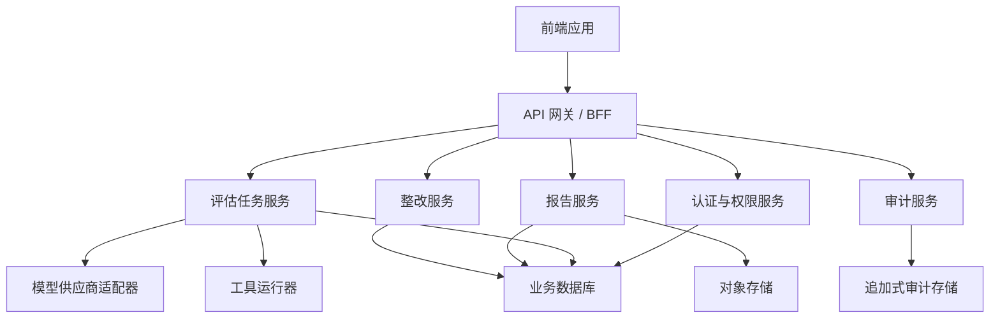

# 后端持久化与 API 设计草案

## 目标

后端持久化改造的目标是把当前前端本地状态升级为可多人协作、可审计、可追溯的业务系统。改造时保持现有产品流程不变，优先替换数据来源和权限边界。

## 当前前端持久化点

| Key | 当前用途 | 后端替代资源 |
| --- | --- | --- |
| `ai-eval-auth` | 当前登录态 | 会话、访问令牌、刷新令牌 |
| `ai-eval-local-accounts` | 本机可登录账号 | 用户、密码哈希、角色绑定 |
| `ai-eval-pentest-reports` | AI 渗透中心生成报告 | 报告、风险、证据、复核结果 |
| `ai-eval-remediation-tasks` | 整改任务 | 整改任务、状态流转、复测记录 |
| `ai-eval-audit-events` | 审计日志 | 不可篡改审计事件 |

## 核心数据模型

| 资源 | 说明 | 关键关联 |
| --- | --- | --- |
| `users` | 平台用户 | roles、audit_events、remediation_tasks |
| `roles` | 角色与权限集合 | users、permissions |
| `model_providers` | 云端或本地模型供应商 | evaluation_tasks、execution_runs |
| `assets` | 被测对象 | evaluation_tasks、reports |
| `checklist_templates` | 检查模板和版本 | evaluation_tasks、reports |
| `evaluation_tasks` | 评估任务 | assets、checklist_templates、execution_runs |
| `execution_runs` | 一次实际执行 | findings、evidence、audit_events |
| `findings` | 结构化风险发现 | evidence、review_results、remediation_tasks |
| `evidence` | 证据链 | findings、execution_runs、reports |
| `review_results` | 审核官或人工复核结果 | findings、reports |
| `reports` | 正式报告 | assets、findings、review_results、report_versions |
| `report_versions` | 报告版本快照 | reports |
| `remediation_tasks` | 整改任务 | findings、users、audit_events |
| `audit_events` | 审计事件 | users、业务资源 |

## API 草案

| API | 方法 | 用途 |
| --- | --- | --- |
| `/api/v1/users` | `GET/POST` | 查询和创建用户 |
| `/api/v1/users/:id` | `PATCH` | 更新用户状态、角色和基础信息 |
| `/api/v1/roles` | `GET` | 获取角色与权限 |
| `/api/v1/model-providers` | `GET/POST` | 查询和新增模型供应商 |
| `/api/v1/model-providers/:id` | `PATCH/DELETE` | 更新或停用供应商 |
| `/api/v1/assets` | `GET/POST` | 管理检测对象 |
| `/api/v1/checklist-templates` | `GET/POST` | 管理检查模板 |
| `/api/v1/evaluations` | `GET/POST` | 创建和查询评估任务 |
| `/api/v1/evaluations/:id/runs` | `GET/POST` | 查询或启动执行记录 |
| `/api/v1/findings` | `GET/POST` | 查询和写入风险发现 |
| `/api/v1/evidence` | `GET/POST` | 保存证据 |
| `/api/v1/reviews` | `GET/POST` | 保存审核官复核结果 |
| `/api/v1/reports` | `GET/POST` | 查询和生成报告 |
| `/api/v1/reports/:id/export` | `POST` | 导出 PDF 或 JSON |
| `/api/v1/remediations` | `GET/POST` | 查询和创建整改任务 |
| `/api/v1/remediations/:id` | `PATCH` | 更新整改状态 |
| `/api/v1/audit-events` | `GET` | 查询审计日志 |

## 服务边界

## 迁移顺序

| 顺序 | 模块 | 原因 | 验收标准 |
| --- | --- | --- | --- |
| 1 | 审计事件 | 风险低、收益高，可先统一追踪 | 登录、报告、整改操作写入后端 |
| 2 | 整改任务 | 业务闭环核心，数据结构明确 | 报告转整改后跨浏览器可见 |
| 3 | 报告、风险、证据、复核 | 产品价值核心，需要结构化沉淀 | 报告详情完全来自后端资源 |
| 4 | 用户、角色、认证 | 涉及安全边界，需专项设计 | 新增用户、登录、禁用、角色变更全部真实生效 |
| 5 | 模型供应商 | 涉及密钥和本地/云端差异 | 云端密钥服务端加密，本地模型按节点探测 |

## 安全要求

1. 密码必须使用强哈希算法保存，禁止明文存储。
2. API Key、模型密钥和私有 endpoint 必须服务端加密保存。
3. 审计事件采用追加写入，业务接口不得提供普通删除能力。
4. 权限必须在后端校验，前端仅用于展示和交互控制。
5. 高风险操作包括停用用户、删除供应商、导出报告、修改角色，必须写入审计日志。
6. 报告中的 AI 推断结论必须保留证据引用，不能作为唯一事实来源。

## 前端改造原则

1. 保留现有页面结构，逐步替换数据层。
2. 每个本地存储模块先封装成 repository 接口，再切换为 API 实现。
3. 同一业务对象只保留一个数据入口，避免报告、整改、审计各自复制状态。
4. 后端接口未完成前，继续保留演示模式，但界面必须明确标注。
5. 每次迁移完成一个资源，就补一条端到端验收用例。

