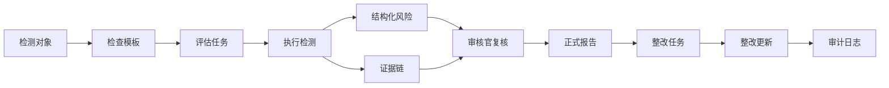

# 产品集成验收清单

## 集成范围

本清单用于验收 Sprint 1 至 Sprint 4 的产品整改结果是否已经形成闭环。当前集成分支为 `codex/integration-product-governance`，按顺序包含以下里程碑：

| 里程碑 | 提交 | 验收主题 |
| --- | --- | --- |
| 0 | `c666787` | 产品蓝图与系统设置基础 |
| 1 | `d5d53a1` | 结构化数据对象与报告模板 |
| 2 | `876f741` | 报告标准化、模板选择、复核结果呈现 |
| 3 | `a20109b` | 整改中心与风险闭环 |
| 4 | `dc65c3c` | 治理审计、登录审计、操作留痕 |

## 端到端验收链路

标准验收链路如下：

验收时至少覆盖一个 Web 渗透测试场景，并确认风险发现、证据、复核、报告、整改和审计事件之间可以互相追溯。

## 功能验收矩阵

| 模块 | 当前状态 | 数据来源 | 验收点 | 后端化下一步 |
| --- | --- | --- | --- | --- |
| 产品整改蓝图 | 已完成 | 前端静态配置 | 能看到对象模型、流程、模板和优先级 | 作为产品文档保留，无需直接入库 |
| 检查模板库 | 已完成 | 前端模板数据 | 支持按对象类型选择模板 | 后端提供模板版本、启停和复制能力 |
| AI 渗透中心 | 已完成 | 本地 Ollama 真实扫描 + 前端任务状态 | 可选择 Agent、启动检测、生成报告 | 后端接管任务编排、运行日志和执行状态 |
| 报告中心 | 已完成 | 演示报告 + 本地生成报告 | 按模板展示报告、复核结论、证据和整改入口 | 后端保存报告版本、导出记录和关联对象 |
| 整改中心 | 已完成 | `localStorage` | 从报告转整改、查看详情、更新状态 | 后端保存整改流转、责任人和复测记录 |
| 系统设置-模型供应商 | 部分完成 | 前端演示数据 + 本机 Ollama 探测 | 明确标识演示数据，Ollama 列表来自本地服务 | 后端保存供应商配置，密钥加密托管 |
| 系统设置-用户账号 | 部分完成 | `localStorage` | 新增用户可用于本机登录 | 后端接管真实用户、密码哈希、会话和权限 |
| 审计日志 | 已完成 | `localStorage` | 登录、报告转整改、整改状态更新有记录 | 后端改为不可篡改审计事件流 |
| 安全基线检查 | 已完成 | 前端规则计算 | 能解释每项检查含义和结果 | 后端定时执行基线规则并保留历史结果 |

## 数据真实性标识

产品界面必须明确区分以下数据来源：

| 标识 | 含义 | 示例 |
| --- | --- | --- |
| 真实本地 | 来自用户本机或真实后端接口 | Ollama 模型列表、真实登录账号 |
| 前端本地存储 | 保存于当前浏览器 | 整改任务、审计日志、本地账号 |
| 演示数据 | 为展示产品形态预置 | 默认模型供应商、示例报告 |
| AI 推断 | 大模型根据输出归纳 | 风险等级、摘要、建议 |
| 工具结果 | 安全工具实际输出 | Nmap、SQLMap、ZAP 输出 |

报告和审计类页面应优先显示数据来源，避免用户误把演示数据理解为真实业务数据。

## 验收准入标准

1. 全量 TypeScript 类型检查通过。
2. 关键页面可打开：`/blueprint`、`/checklists`、`/pentest-hub`、`/reports`、`/remediations`、`/settings`。
3. 至少一条报告可以转为整改任务。
4. 整改任务状态更新后，审计日志可看到对应事件。
5. 报告详情不直接展示大段原始文本作为核心内容，必须先展示结构化摘要、复核结论和风险列表。
6. 用户、模型供应商、统计卡片等数据必须明确标注真实数据、前端本地数据或演示数据。

## 不进入本次验收的事项

以下能力不在 Sprint 5 中直接实现，但必须进入后端持久化计划：

| 能力 | 原因 |
| --- | --- |
| 生产级认证与会话管理 | 需要后端、密码哈希、刷新令牌和权限中间件 |
| 模型供应商密钥托管 | 需要服务端加密存储和访问控制 |
| 多租户组织隔离 | 需要统一租户模型和数据权限 |
| 报告 PDF 服务端生成 | 需要稳定的模板引擎和文件存储 |
| 审计日志防篡改 | 需要后端追加写入和保留策略 |

